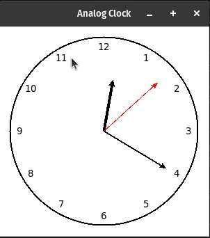

# Analog Clock

## Description

This program utilizes the Python tkinter library to create a simple analog clock that displays the current time with hour, minute, and second hands.

## How it Works

- The program starts by initializing a tkinter root window and setting its title to "Analog Clock". It also defines the dimensions of the canvas.

- A canvas widget is created within the root window with the specified dimensions. The canvas serves as the platform for drawing the analog clock.

- The <code>draw_clock</code> function is called to draw the clock face. This involves creating a circular outline (the clock face) at the center of the canvas. Additionally, hour labels are placed around the clock face to represent the hours from 1 to 12.

- The <code>update_clock</code> function is called to update the clock every second. This function clears the canvas, redraws the clock to reflect the updated time, and schedules itself to be called again after 1000 milliseconds (1 second) to maintain real-time updates.

- The hour, minute, and second hands are drawn based on the current time. The positions of these hands are calculated using trigonometric functions and angles, ensuring they accurately represent the current hour, minute, and second.

- The program enters the tkinter event loop using <code>root.mainloop()</code>, allowing the application to respond to user interactions and continuously update the clock every second.

## Program Output

When you run the program, `analog_clock.py`, the output will look like this:

  

