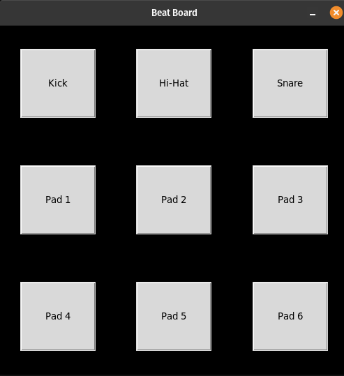

# Beat Board

## Description

Beat Board is a simple drum pad application that allows users to play drum sounds using either keyboard input or by clicking on buttons displayed on the interface. Each drum sound is associated with a specific key and button, providing an interactive way to experiment with creating beats.

## How it Works

- The program utilizes the <code>playsound</code> library to play audio files representing different drum sounds (e.g., kick, hi-hat, snare, pads). 

- The sound locations for each drum sound are stored in a list, associating each sound with a specific audio file.

- The <code>main</code> function created the main window, sets up the layout, and binds the event handlers for each drum sound.

- The <code>play_sound</code> function utilizes the <code>playsound</code> library to play the audio corresponding to a specific drum sound.

- The <code>create_buttons</code> function creates buttons for each drum sound and binds them to the <code>play_sound</code> function, allowing users to play sounds by clicking on the buttons. Additionally, keyboard shortcuts are provided for each sound. When the associated key is pressed, it triggers the corresponding drum sound.

- The <code>create_layout</code> function sets up the layout of the application by creating a frame and placing buttons in a grid pattern using the <code>create_buttons</code> function.

## Program Input & Output

When you run the program `beat_board.py`, the program will produce a sound output corresponding to the specific drum sound triggered by the user. The interface will look like this:

  

- <strong>Input:</strong> The user can trigger drum sounds by pressing the designated keys (q, w, e, a, s, d, z, x, c) or by clicking the corresponding buttons on the interface.
- <strong>Output:</strong> The program produces sound output corresponding to the specific drum sound triggered by the user.