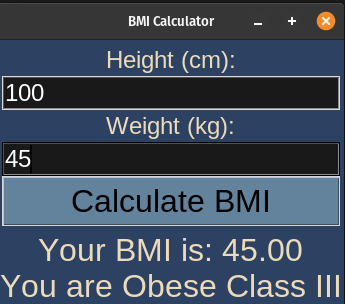

# BMI Calculator

## Description

The BMI (Body Mass Index) calculator is a simple tool that allows users to calculate their BMI based on their height and weight. BMI is a numerical value of a person's weight in relation to their height. It is used to classify individuals into different weight categories, indicating whether they are underweight, normal weight, overweight, or obese.

The BMI is calculated using the following formula: $BMI = \frac{\text{Weight (kg)}}{(\text{height (m)})^2} = \frac{\text{Weight (kg)}}{(\frac{\text{height (cm)}}{100})^2}$


## How it Works

- Program starts by creating a GUI window using the <code>Tk()</code> class from tkinter. It sets up the main frame, labels, entry fields for height and weight, a button to trigger the calculation, and a label to display the result.

- The user provides their height (in cm) and weight (in kg) through the GUI by entering the values in the respective entry fields.

- When the user clicks the "Calculate BMI" button, the program triggers the <code>calculate_bmi</code> function. This function reads the input values, converts them to floats, and calculates the BMI using the formula described above.

- After calculating the BMI, the program calls the <code>classify_bmi</code> function to determine the classification based on the BMI value. It returns a classification such as "Normal", "Overweight", "Obese Class I", etc.

- The calculated BMI and the classification are displayed on the GUI using a label.


## Program Output

Make sure you have the Python tkinter library installed. Run the following command in the terminal to start the application:
```bash
python3 bmi_calculator.py
```

When you run the program `bmi_calculator.py`, the output will look like this:

<p align="center">
  
  
</p>

<p align="center">
  
  
</p>