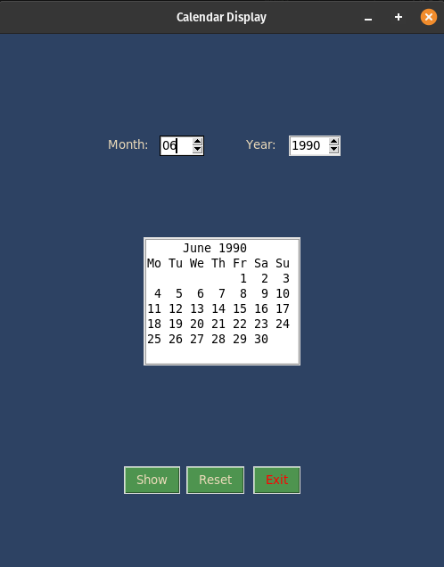

# Calendar Display Application

## Description

This is a simple calendar display application created using the Tkinter library. The application allows users to input the desired month and year and displays the corresponding calendar.

## How it Works

- The <code>main()</code> function sets up the main GUI window and creates various frames to organize the layout. It also defines the structure of the GUI, including labels, spin boxes, a text box for displaying the calendar, and buttons for triggering actions.

- The <code>show_calendar()</code> function is responsible for retrieving the selected month and year from the user and generating the calendar for that month and year using the <code>calendar</code> module. The resulting calendar is displayed in the text box.

- The <code>reset_calendar()</code> function clears the displayed calendar and resets the month and year values to the current month and year. It updates the spin boxes accordingly.

- The <code>exit_program()</code> function allows the user to exit the application by closing the main window.

## Program Output

When you run the program, `calendar_display.py`, the output will look like this:

  

