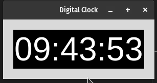

# Digital Clock

## Description

This Python program utilizes the tkinter library to create a simple digital clock that displays the current time in hours, minutes, and seconds.

## How it Works

- The program defines the <code>main</code> function that creates a tkinter window titled "Digital Clock". A label widget is created within the window to display the time. The font, background, and foreground colors are specified for aesthetic purposes.

- The <code>update_time</code> function is called to update the displayed time every second. It retrieves the current time in hours, minutes, and seconds using the <code>strftime</code> function and updates the label to display the current time.

- The time is initially updated and then continuously updated every second using the <code>root.after</code> method.

- The program enters the tkinter event loop using <code>root.mainloop()</code>, allowing the application to respond to user interactions and continuously update the time display every second.

## Program Output

Make sure you have the Python tkinter library installed. Run the following command in the terminal to start the application:
```bash
python3 digital_clock.py
```

When you run the program, `digital_clock.py`, the output will look like this:

<p align="center">
  
</p>