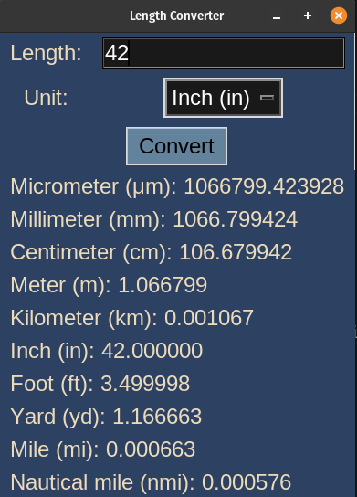
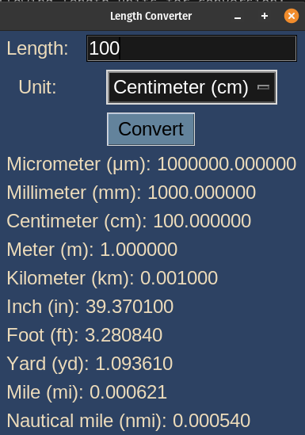

# Length Converter

## Description

This is a simple length converter application implemented using the Python tkinter library. It allows users to convert lengths from one unit to another using predefined conversion factors.

The application supports the following length units for conversion:
- Micrometer (μm)
- Millimeter (mm)
- Centimeter (cm)
- Meter (m)
- Kilometer (km)
- Inch (in)
- Foot (ft)
- Yard (yd)
- Mile (mi)
- Nautical mile (nmi)

## How it Works

- The <code>main()</code> function creates the main application window and sets up the user interface. The interface includes entry widgets for length input and a dropdown menu to select the unit of conversion. The user can click the "Convert" button to initiate the conversion.

- The <code>convert_length(length, unit, display_frame)</code> function is responsible for converting the input length to all available length units and displaying the results. It takes the input length, the selected unit for conversion, and the frame where the results will be displayed as arguments.
    - The function first attempts to convert the input length to meters based on the selected unit's conversion factor.
    - Next, it calculates the length in each available length unit by multiplying the length in meters by the respective conversion factor.
    - The function dynamically creates and updates labels to display the converted lengths for each unit in the provided display frame.
    - If the input length is invalid (e.g., not a number), an error message is displayed in the frame.


## Program Output

Make sure you have the Python tkinter library installed. Run the following command in the terminal to start the application:
```bash
python3 length_converter.py
```

When you run the program, `length_convert.py`, the output will look like this:

<p align="center">
  
  
</p>
