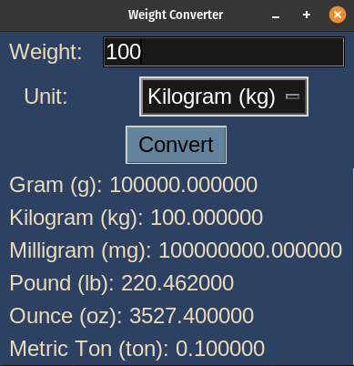
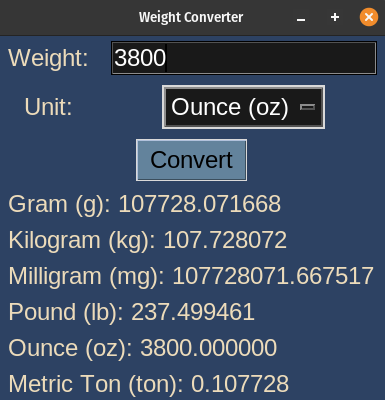

# Mass Converter

## Description

This is a simple mass converter application implemented using the Python tkinter library. It allows users to convert masses from one unit to another using predefined conversion factors.

The application supports the following mass units for conversion:
- Gram (g)
- Kilogram (kg)
- Milligram (mg)
- Pound (lb)
- Ounce (oz)
- Metric Ton (ton)

## How it Works

- The <code>main()</code> function creates the main application window and sets up the user interface. The interface includes entry widgets for length input and a dropdown menu to select the unit of conversion. The user can click the "Convert" button to initiate the conversion.

- The <code>convert_weight(weight, unit, display_frame)</code> function is responsible for converting the input weight to all available mass units and displaying the results. It takes the input weight, the selected unit for conversion, and the frame where the results will be displayed as arguments.
    - The function first attempts to convert the input weight to grams based on the selected unit's conversion factor.
    - Next, it calculates the weight in each available mass unit by multiplying the weight in grams by the respective conversion factor.
    - The function dynamically creates and updates labels to display the converted weights for each unit in the provided display frame.
    - If the input weight is invalid (e.g., not a number), an error message is displayed in the frame.


## Program Output

Make sure you have the Python tkinter library installed. Run the following command in the terminal to start the application:
```bash
python3 mass_converter.py
```

When you run the program, `mass_converter.py`, the output will look like this:

<p align="center">
  
  
</p>
