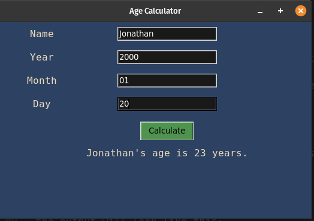

# Age Calculator

## Description

This program is a simple age calculator implemented using Python's tkinter library. It allows the user to input their name and birthdate (year, month, and day) and calculates their age based on the current date. The age calculation is performed using the <code>datetime</code> module.

## How it Works

- The program starts by initializing a tkinter window titled "Age Calculator".

- The user is prompted to enter their name, year of birth, month of birth, and day of birth through the graphical user interface (GUI).

- The <code>calculate_age</code> function is called and retrieves the user's input for the year, month, and day of birth. It then uses the <code>datetime</code> module to calculate the age based on the current date.

- The calculated age is displayed in the GUI, indicating the user's age in years.

- The program continues to run, allowing the user to calculate age for different input values.


## Program Output

Make sure you have the Python tkinter library installed. Run the following command in the terminal to start the application:
```bash
python3 age_calculator.py
```

When you run the program, `age_calculator.py`, the output will look like this:

<p align="center">
  
</p>