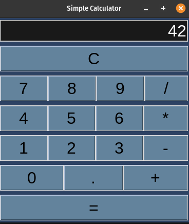
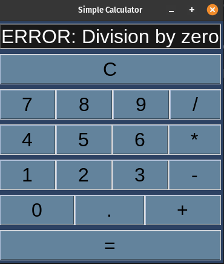

# Simple Calculator

## Description

This program implements a simple calculator using the tkinter library in Python. The calculator allows users to perform basic arithmetic operations such as addition, subtraction, multiplication, and division.

## How it Works

- The program uses the <code>tkinter</code> library to create a graphical user interface for the calculator. A frame is created to organize the various components of the calculator.

- The calculator consists of an entry field to display input and results, numeric and operator buttons, and a clear button to reset the display.

- Numeric and operator buttons are used to input expressions, and the clear button allows the user to reset the display.

- The <code>eval</code> function is used to evaluate the expression entered by the user and display the result in the entry field.

- Error handling is implemented to catch division by zero and other potential errors during evaluation.

## Program Input & Output

Make sure you have the Python tkinter library installed. Run the following command in the terminal to start the application:
```bash
python3 simple_calculator.py
```

When you run the program, `simple_calculator.py`, the output will look like this:

<p align="center">
  
  
</p>

- <strong>Input</strong>: Users can input expressions using the numeric buttons (0-9) and the operator buttons (+, -, *, /). The 'C' button clears the display for a new input.
- <strong>Output</strong>: The result of the expression is displayed in the entry field when the '=' button is pressed. In case of errors (e.g., division by zero), an error message is displayed.