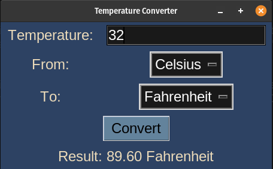
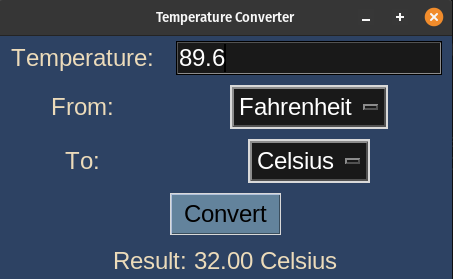

# Temperature Converter

## Description

This is a simple temperature converter application implemented using the Python tkinter library. It allows users to convert temperatures between Celsius and Fahrenheit.

## How it Works

- The <code>main()</code> function creates the main application window and sets up the user interface. The interface includes entry widgets for temperature input, dropdown menus to select the unit of conversion ("From" and "To" units), and a button to initiate the conversion.

- The <code>convert_temperature(temp_str, from_unit, to_unit, result_var)</code> function is responsible for converting the input temperature to the desired unit and updating the result label. It handles conversions between Celsius and Fahrenheit using nested functions for each conversion.


## Program Output

Make sure you have the Python tkinter library installed. Run the following command in the terminal to start the application:
```bash
python3 temp_converter.py
```

When you run the program, `temp_converter.py`, the output will look like this:

<p align="center">
  
  
</p>
