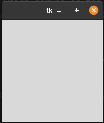
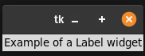
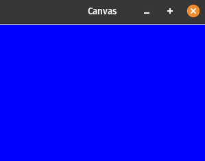
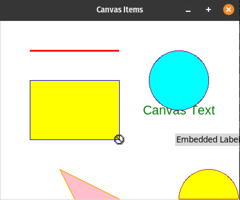

# Tkinter Widget Demonstrations

This folder contains Python programs demonstrating the usage of various Tkinter widgets and canvas items. Below is an overview of each program along with its description and how it works.

## 1. tk_widget.py

### Description

This program demonstrates the basic structure of a Tkinter application by creating a root widget and running the event loop.

### How it Works

- <strong>Import Tkinter</strong>: The <code>Tk</code> class is imported from the <code>tkinter</code> module.
- <strong>Root Widget Creation</strong>: A root widget is created using <code>Tk()</code>.
- <strong>Event Loop</strong>: The <code>mainloop()</code> method is called on the root widget, starting the event loop.

### Program Output

- When you run the program `tk_widget.py`, the program will display a blank window, demonstrating the fundamental structure of a Tkinter application with an event loop. As seen below:

  

## 2. tk_label_widget.py

### Description

This program showcases the usage of a Label widget in a Tkinter application.

### How it Works

- <strong>Import Tkinter</strong>: The <code>Tk</code> class is imported from the <code>tkinter</code> module.
- <strong>Root Widget Creation</strong>: A root widget is created using <code>Tk()</code>.
- <strong>Label Widget</strong>: A Label widget with specified text is created and packed.
- <strong>Event Loop</strong>: The <code>mainloop()</code> method is called on the root widget, starting the event loop.

### Program Output

- When you run the program `tk_label_widget.py`, the output will look like this:

  

## 3. tk_canvas_widget.py

### Description

This program demonstrates the usage of a Canvas widget and customizing its properties.

### How it Works

- <strong>Import Tkinter</strong>: The <code>Tk</code> class is imported from the <code>tkinter</code> module.
- <strong>Root Widget Creation</strong>: A root widget is created using <code>Tk()</code>.
- <strong>Canvas Widget</strong>: A Canvas widget with specified dimensions and background color is created and packed.
- <strong>Event Loop</strong>: The <code>mainloop()</code> method is called on the root widget, starting the event loop.

### Program Output

- When you run the program `tk_canvas_widget.py`, the output will look like this:

  

## 4. tk_canvas_items.py

### Description

This program showcases the usage of various canvas items such as lines, rectangles, ovals, polygons, arcs, bitmaps, and embedded widgets on a Canvas widget.

### How it Works

- <strong>Import Tkinter</strong>: The <code>Canvas</code> and <code>Label</code> classes are imported from the <code>tkinter</code> module.
- <strong>Root Widget Creation</strong>: A root widget is created using <code>Tk()</code>.
- <strong>Canvas Widget</strong>: A Canvas widget with specified dimensions and background color is created and packed.
- <strong>Canvas Items</strong>: Various canvas items like lines, rectangles, ovals, polygons, arcs, images, bitmaps, and an embedded label are added to the Canvas.
    - The <code>create_line()</code> method is used to draw a line on the canvas. It takes the coordinates of the starting and ending points of the line, as well as options like color and width.
    - The <code>create_rectangle()</code> method is used to draw a rectangle on the canvas. It takes the coordinates of the top-left and bottom-right corners of the rectangle, along with options for outline color and fill color.
    - The <code>create_text()</code> method is used to display text on the canvas. It takes the coordinates of the text anchor point, the text to display, text color, font, and other options.
    - The <code>create_oval()</code> method is used to draw an oval on the canvas. It takes the coordinates of the bounding box for the oval and options for outline color and fill color.
    - The <code>create_polygon()</code> method is used to draw a polygon on the canvas. It takes the coordinates of the vertices of the polygon and options for outline color and fill color.
    - The <code>create_arc()</code> method is used to draw an arc or a partial oval on the canvas. It takes the coordinates of the bounding box for the oval, start and extent angles for the arc, and options for outline color and fill color.
    - The <code>create_bitmap()</code> method is used to display a bitmap on the canvas.
    - The <code>create_window()</code> method is used to embed another Tkinter widget (in this case, a Label) within the canvas.

- <strong>Event Loop</strong>: The <code>mainloop()</code> method is called on the root widget, starting the event loop.

### Program Output

- When you run the program `tk_canvas_items.py`, the output will look like this:

  

